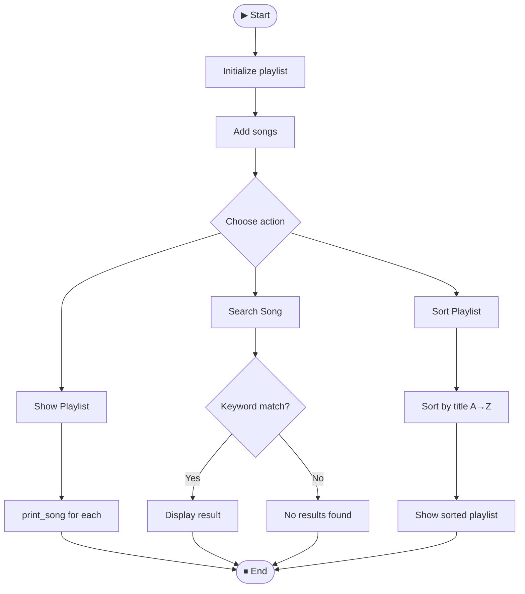
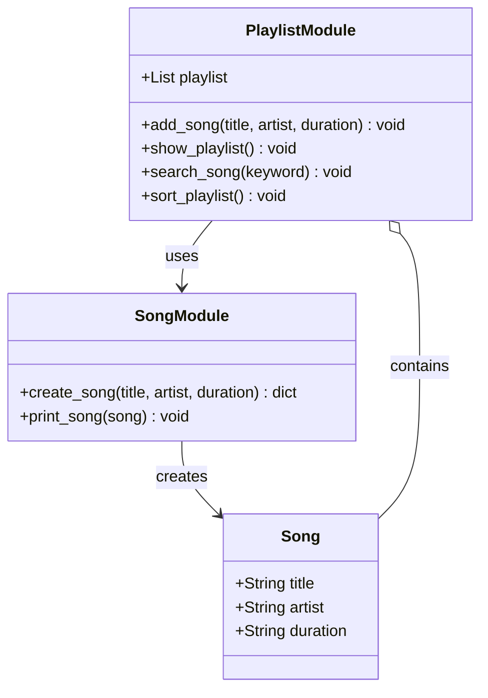
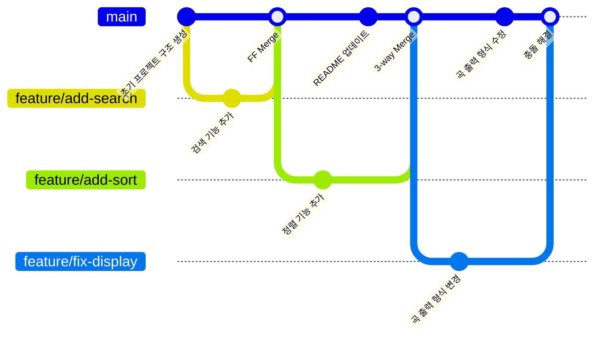

# 🎵 Playlist Manager

> A simple Python-based playlist management program.  
> Add, search, sort, and display your favorite songs from the terminal.

---

## 📁 Project Structure

```
playlist-manager/
├── README.md               # Project documentation
├── src/                    # Source code
│   ├── playlist.py         # Core playlist management logic
│   └── song.py             # Song data model & display
└── data/                   # Data files
    └── songs.txt           # Sample song list
```

---

## ✨ Features

| Feature | Description |
|--------|-------------|
| ➕ Add Song | Add a song with title, artist, and duration |
| 📋 Show Playlist | Display all songs in the playlist |
| 🔍 Search Song | Search songs by keyword |
| 🔤 Sort Playlist | Sort songs alphabetically by title |

---

## 🔄 Program Flow



---

## 🏗️ Class Diagram



---

## ⚙️ Installation & Usage

### Requirements
- Python 3.x

### Run
```bash
python src/playlist.py
```

### Example Output
```
'Last Night on Earth' 추가 완료!
'One Last Kiss' 추가 완료!
'Pump Up the Volume' 추가 완료!

=== 플레이리스트 ===
🎵 [3:58] Last Night on Earth by Green Day
🎵 [5:12] One Last Kiss by Hikaru Utada
🎵 [3:30] Pump Up the Volume by PLAVE

=== 'Last' 검색 결과 ===
🎵 [3:58] Last Night on Earth by Green Day

제목 기준으로 정렬 완료!
```

---

## 🎵 Sample Songs (`data/songs.txt`)

```
Last Night on Earth - Green Day - 3:58
One Last Kiss - Hikaru Utada - 5:12
Pump Up the Volume - PLAVE - 3:30
```

---

## 🌿 Git Branch Strategy



---

## 📄 License

This project is for educational purposes.
